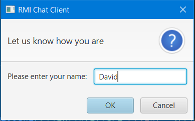
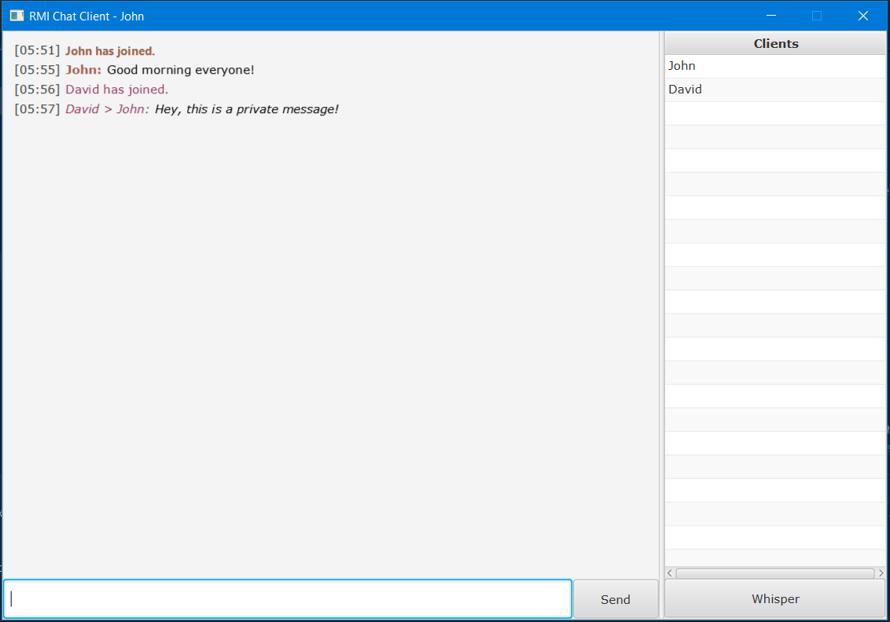

# Client Setup

Once we're done with our server setup tour, we can take a look at how our client setup is implemented.

**Note:** We will be showcasing the different client features in the following section.

## Client Interface

The interface will define the contract to be used within our client implementation, it regroups six main features:

*You can notice similarities between these features and the one on the server's interface, it is normal since a client will ask the server to perform "Action A" and the server will have an implementation of said action, hence the somewhat duplication*

* **Show Client Login** Displays that a user has logged in.


<span class="caption">Figure 7. New client notification</span>

* **Show Client Message** Displays the user's global message, seen by everyone.


<span class="caption">Figure 8. New message notification</span>

* **Show Client Whisper** Display's the whisperer's message to the "whisperee" only, without showing it to other clients.


<span class="caption">Figure 9. Whisper notification</span>

* **Show** A wrapper for all the above features above and groups the timstamp, the speaker and the message to be formatted according the context (login notification, global message or whisper)

* **Get Username** Offers access to the client's username.

* **Get Hex Color** *An extra feature* that assigns a random color to each client to be distingued by when chatting.


<span class="caption">Figure 10. Clients colors</span>

The source code for the interface can be found under **code/src/client/ClientInterface.java**

## Client Implementation

Now that we have defined the interface to rely on, we need to implement the different features.

In my opinion, the only feature worth showing on this report is the **connect** function that allows clients to connect to the server depending on the configuration that we mentioned earlier

```
static ClientInterface connect(String username) {
        ClientInterface client = null;

        try {
            Registry registry = LocateRegistry.getRegistry(Config.PORT);
            server = (ServerInterface) registry.lookup(Config.SERVER_NAME);
            client = server.register(new ClientImplementation(username));
        } catch (RemoteException | NotBoundException e) {
            Helpers.alertException(e);
            Platform.exit();
            System.exit(0);
        }

        return client;
    }
```

The other features' implementations can be found under **code/src/client/ClientImplementation.java**

## Client UI

The user interface has been done using JavaFX once more and offers two screens, one to input the client's username and a second one showing the chat's main view with messages, clients list and composing text field.


<span class="caption">Figure 11. Client UI - Name Input</span>


<span class="caption">Figure 12. Client UI - Main Chat Screen</span>

The source code for the UI can be found under **code/src/client/Client.java** and **code/src/client/ClientController.java**

