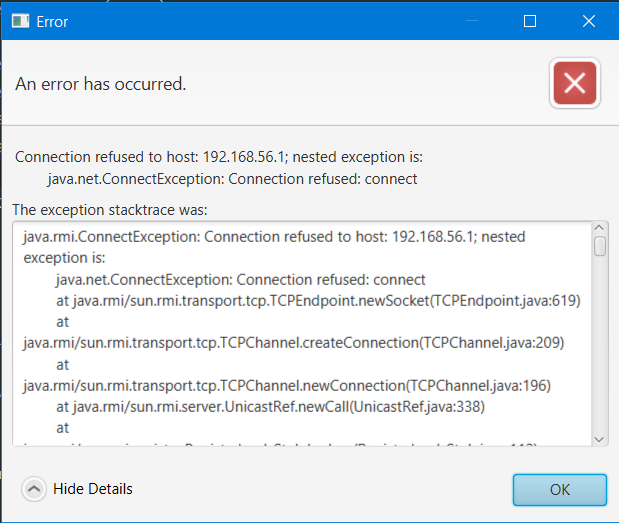

# Helpers

Just before showing the application's features, we need to mention the different helpers that have been used and allowed for a clean code and easy refactoring, although they are not project related. These helpers can be found under **code/src/helpers/Helpers.java**

* **Class helpers** These helpers allow us to dynamically add and remove CSS classes from the UI elements, much like the button color on the server interface, that switches between red and green depending on if the server is OFF or ON.

* **Exceptions Alert** Because the application is meant to be used by end-users, we cannot afford printing errors to the console, we need a visual helper to allow user to understand why the application has failed.

Figure 13. Exception Alert - Server Down

* **Timestamp** A nice helper that allows us to display the time at which messages have been sent.

Figure 14. Timestamp Helper

* **Logging** All chat messages, actions, whispers and errors are being logged for various purposed in .log files