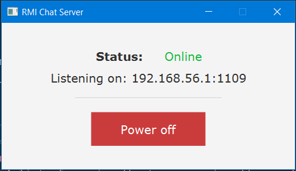

# Server Setup

The server is the heart of our chat application, where all clients will relay responsability to inform other clients through RMI.

## Server Interface

The interface will define the contract to be used within our server implementation, it regroups four main features:

* **Register** Registers a new client and notifies everyone of its arrival


<span class="caption">Figure 1. New client notification</span>

* **Send** Send a message to all clients notifying of a speaker's new message.


<span class="caption">Figure 2. New message notification</span>

* **Whisper** *An extra feature* allowing a client to send a private message to another client without being seend by others.


<span class="caption">Figure 3. Whisper notification</span>

* **Clients List** Allows for a listing for connected client


<span class="caption">Figure 4. Clients list</span>

The source code can be found in **code/src/server/ServerInterface.java**

## Server Implementation

After defining the contracts, we need to implement how each feature works.

The most important features are **start** and **stop**, they allow for the server to be started and stopped at will, which adds a level of control.

We have decided to avoid using the usual **rmiregistery** command that starts a server for us, to offer a packaged chat application to be used on the fly by any user.

```
    private static void start() throws RemoteException {
        registry = LocateRegistry.createRegistry(Config.PORT);
        registry.rebind(Config.SERVER_NAME, new ServerImplementation());
        System.out.println("Server running...");
        online = true;
    }
    
    private static void stop() throws RemoteException, NotBoundException {
        registry.unbind(Config.SERVER_NAME);
        UnicastRemoteObject.unexportObject(registry, true);
        System.out.println("Server terminated.");
        online = false;
    }
```

<video width="800" controls>
  <source src="_videos/server_on.mp4" type="video/mp4">
Your browser does not support the video tag.
</video>

<span class="caption">Video 1. Server Start<span>

The source code can be found in **code/src/server/ServerImplementation.java** and regroups the implementation of the other methods.

## Configuration

We have set a dynamic level of configuration to allow for server owners to tweak the settings at will:

```
server_ip=169.254.76.192
rmi_port=1109
server_name=rmi-chat
proxies=proxy_1,proxy_2,proxy_3
```

* **server_ip** The IP address of the machine where the server is running to allow connection from the clients.
* **rmi_port** The default port to be used by RMI, it can be modified if busy or for other reasons.
* **server_name** The server name to be used when discovering agents by the clients.
* **proxies** A list of proxies (hostnames or ip addresses) to be used by clients to lessen the load on the server or for proximity reasons. On startup, the client will check, one by one, the list of proxies and attempt to connect to them, on total failure, it will then connect on the machine's IP address. We could have used a more complexe strategy but it seemed outside of the project's scope.

The configuration files can be found under **code/src/helpers/config.properties** and **code/src/helpers/Config.java**

## Server UI

The user interface is a mandatory component due to our used approach (bypassing the need of running **rmiregistery** from the terminal and allowing total control to server owners). We have used JavaFX to construct the user interface with three simple elements, a status label showing whether the server is ON or OFF, an information label showing the IP address and the port used by the server and finally a button that starts and stops the server depending on its current status.


<span class="caption">Figure 5. Server OFF</span>


<span class="caption">Figure 6. Server ON</span>

The source code for the UI can be found under **code/src/server/Server.java** and **code/src/server/ServerController.java**
